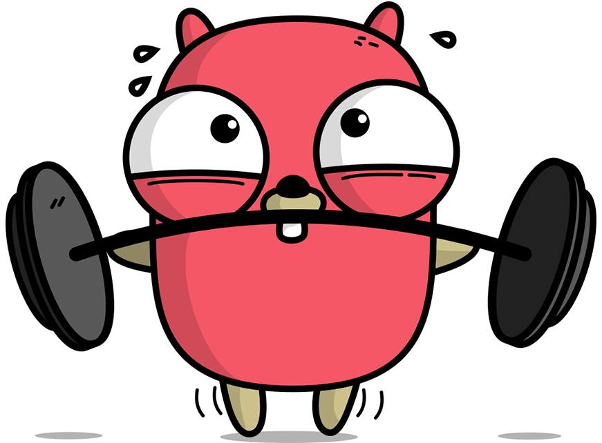
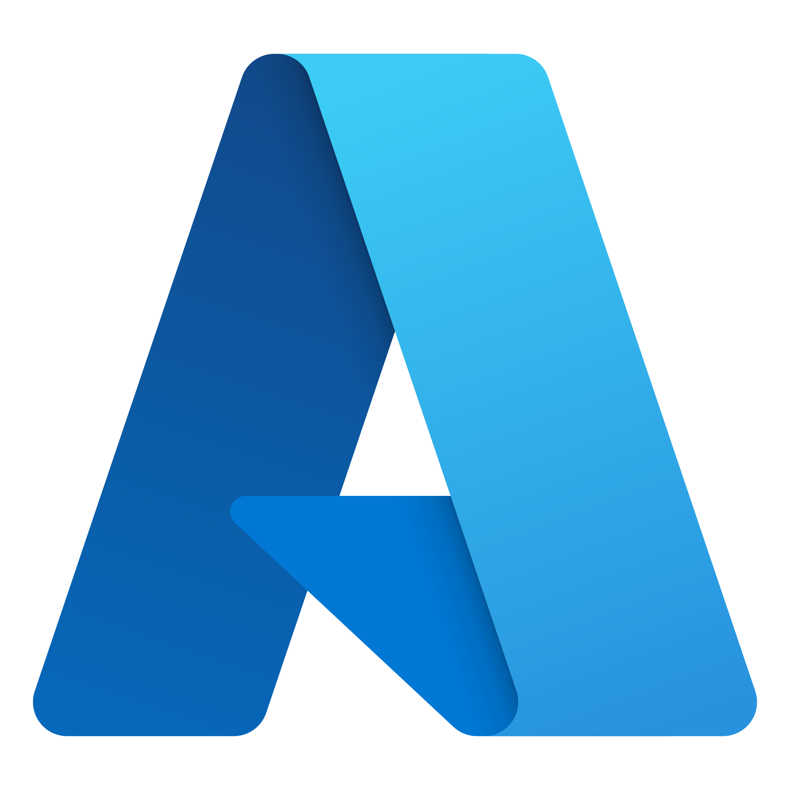

# Hi 👋, I'm Baivab Mukhopadhyay 

### A passionate Golang developer & MLops Engineer

    

    

        
    

    

        <ul>
            <li>🌱 I'm currently learning about <strong>Distributed System</strong></li>
            <li>💬 Ask me about <strong>GO, Cloud and Devops</strong></li>
            <li>📫 How to reach me <strong><a href="mailto:mukhopadhyaybaivab77@gmail.com">mukhopadhyaybaivab77@gmail.com</a></strong></li>
            <li>⚡ Fun fact: I love to play guiter and listen to music</li>
            <li>👯 I’m looking to collaborate on <strong>Open Source Projects</strong></li>
        </ul>
    

**Cloud Services:**
> I have experience with various cloud platforms and services.
<table>
  <tr>
    <td align="center" width="96">
      
       AWS
    </td>
    <td align="center" width="96">
      
       Azure
    </td>
    <td align="center" width="96">
      
       GCP
    </td>
  </tr>
</table>

**Cloud Services Experience:**
- **AWS**: EC2, S3, Lambda, CloudWatch, Route 53, RDS
- **Azure**: App Service, Azure Functions, Azure DevOps, Virtual Machines
- **GCP**: Compute Engine, Cloud Functions, BigQuery, Cloud Storage

**Programming and Languages**

> Tools, languages, and other things that I like to work with.

<table>
  <tr>
    <td align="center" width="96">
      
       Golang 
    </td>
    <td align="center" width="96">
      
       Python
    </td>
    <td align="center" width="96">
      
       Jenkins
    </td>
    <td align="center" width="96">
      
       Ansible
    </td>
    <td align="center" width="96">
      
       Kubernetes
    </td>
    <td align="center" width="96">
      
       Docker
    </td>
    <td align="center"  width="96">
      
       Debian
    </td>
    <td align="center" width="96">
      
       Grafana
    </td>
  </tr>
</table>

### Connect with me

## &#x1f4c8; GitHub Stats

  <table>
    <tr>
      <td align="center">
        
      </td>
      <td align="center">
        
      </td>
    </tr>
    <tr>
      <td align="center">
        
      </td>
      <td align="center">
        
      </td>
    </tr>
  </table>

## Medium Blogs

